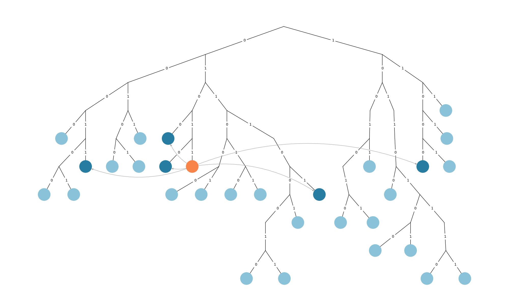

# kademlia
Assignment for the course on Distributed Systems 2.

The goal of this assignment is to implement the Kademlia protocol in Python and simulate its behaviour to later conduct a performance evaluation analysis. In order to have a protocol to which compare Kademlia to, we also implement the Chord DHT.

# Installation
* Clone this repository: 
    ```[bash]
    git clone git@github.com:GiovanniZotta/kademlia.git
    ```
* [Optional] Create a virtual environment:
    ```[bash]
    python3 -m venv path-to-venv
    source path-to-venv/bin/activate
    ```
* Install the package in edit mode:
    ```[bash]
    pip install -e "kademlia[test]"
    ```
* Check that all the tests are working:
    ```[bash]
    pytest
    ```
* Try it out! To run a simulation for both DHTs you can use the following command:
    ```[bash]
    make plots NODES=100 TIME=1000 RATE=0.1
    ```
* The plots will end up in res/plots. The Makefile offers various commands such as:
    ```[bash]
    make plots
    make plot_network
    make plot_arrival_rate
    ```

# Plots
Our simulator offers the possibility to make a chart of the DHT from the perspective of a node.




